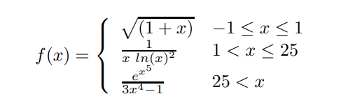
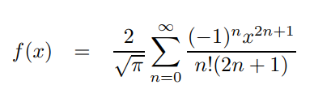

# Container series of exercises in C from Aegean University

---

## Exercise (1) Function Values

Show f(x) values based on x given and x with 8 decimal points.

---

## Exercise (2) Binary Representation

Show binary representation of an integer

---

## Exercise (3) Taylor Series

Show f(x) based on x, show x. Series calculation terminates in that condition of the sum which when added to the preceding sum the change in the sum is not greater than e = 10−6. Try it with x=[0,2] with step 0.5.
